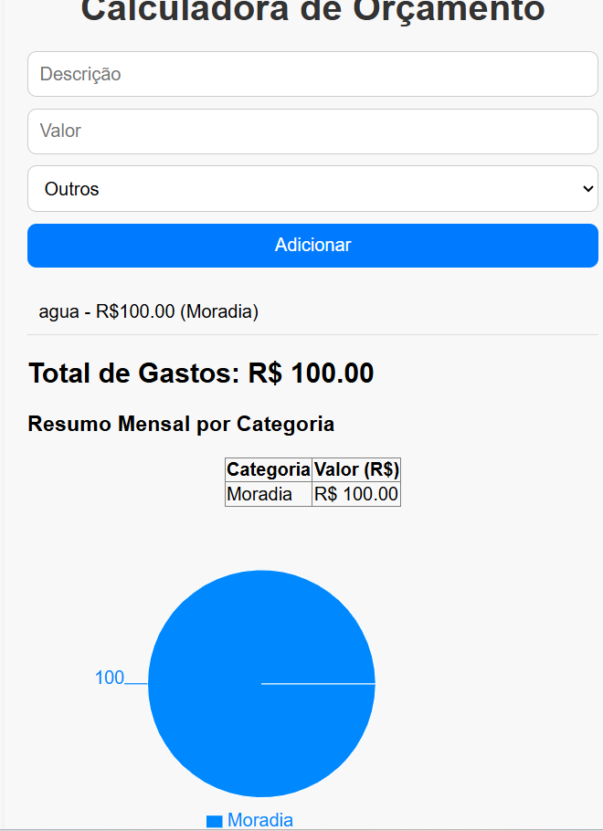

# 📊 Calculadora de Orçamento Pessoal

[](https://github.com/juciiara/calculadora-orcamento-pessoal)
[](https://github.com/juciiara/calculadora-orcamento-pessoal)
[](LICENSE)

---

## 💻 Sobre o Projeto
Este é um projeto simples de **Calculadora de Orçamento Pessoal**, desenvolvido utilizando **React**.  
Permite ao usuário registrar despesas, visualizar um resumo por categoria, acompanhar o total gasto e analisar os dados em um **gráfico de pizza interativo**.  
Este foi meu **primeiro projeto em React**, focado em aplicar conceitos fundamentais de front-end.

---

## 🖼️ Screenshot da Aplicação

<p align="center">
  
</p>

*(Coloque a imagem `screenshot.png` na raiz do projeto, na mesma pasta do README.md.)*

---

## 🔧 Tecnologias Utilizadas
- React  
- JavaScript (ES6+)  
- HTML5  
- CSS3  
- Recharts (para gráficos)

---

## 🎯 Funcionalidades
- Adicionar despesas com **descrição**, **valor** e **categoria**  
- Validação para evitar valores inválidos  
- Exibir lista de despesas adicionadas  
- Cálculo automático do **total de gastos**  
- Resumo mensal por categoria em tabela  
- Exibição dos gastos em **gráfico de pizza**  
- Mensagem de erro quando algum campo estiver incorreto

---

## 🚀 Como Rodar o Projeto

**1. Clone este repositório**
```bash
git clone https://github.com/juciiara/calculadora-orcamento-pessoal.git

2. Entre na pasta do projeto
-- cd calculadora-orcamento-pessoal

3. Instale as dependências
-- npm install

4. Inicie o servidor de desenvolvimento
-- npm start

5. Abra no navegador
http://localhost:3000

📂 Estrutura do Projeto
calculadora-orcamento-pessoal/
├─ public/
├─ src/
│  ├─ components/
│  │  ├─ Botao.js
│  │  ├─ Input.js
│  │  ├─ ListaDespesas.js
│  │  └─ Resumo.js
│  ├─ App.js
│  ├─ App.css
│  └─ index.js
├─ package.json
├─ README.md
└─ screenshot.png

📬 Contato

GitHub: @juciiara

📜 Licença

Este projeto está licenciado sob a Licença MIT - veja o arquivo LICENSE
 para mais detalhes.